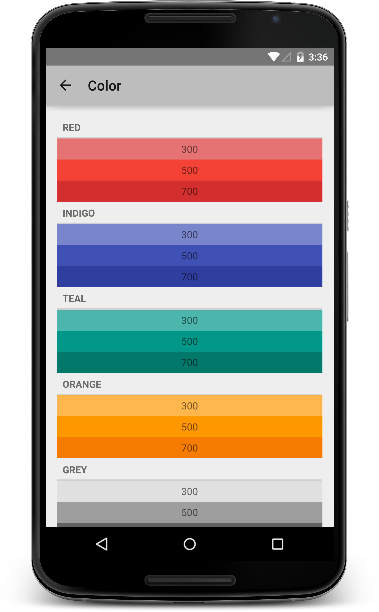
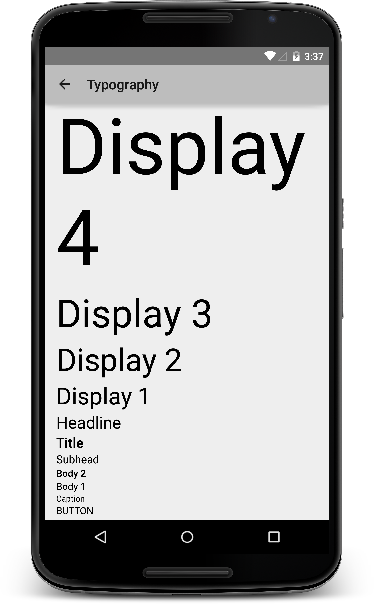

# Support Library for Material Design

Google has released its new design guideline called [Material Design](http://www.google.com/design/spec/material-design/introduction.html) with `Android 5.0(Lollipop, API Level 21)` release with detailed guideline conatins lots of color, keyline, metrics, etc..

This library provides useful resources for applying Google's [Material Design](http://www.google.com/design/spec/material-design/introduction.html) to your Android application.

## Usage

You can get this library on the [Maven Central repository](http://search.maven.org/). All you have to do is just adding  `com.androidhuman:support-material:0.1.1@aar` as a dependency to your `build.gradle` file.

	apply plugin: 'com.android.application'

	android {
	    // Your application configurations...
	}

	dependencies {
	    // Other depedencies...
	    compile 'com.androidhuman:support-material:0.1.1@aar' // Add this line
	}

## Supported items
### Color palette

Color values listed on [Style > Color](http://www.google.com/design/spec/style/color.html#color-color-palette) section.

Each item's name is formatted as `material_{COLOR_NAME}_{DEGREE}`. For instance, for Material Purple with degree of 500, its name will be `material_purple_500`.

####Usage in code

    TextView tv = (TextView) findViewById(R.id.tv);
    tv.setTextColor(getResources().getColor(R.color.material_pink_500));

####Usage in resource

	<resources>
	    <!-- Base application theme. -->
	    
	</resources>

### Typography

Typographic guidelines listed on [Style > Typography](http://www.google.com/design/spec/style/typography.html#typography-standard-styles) section.

Since applying font family([android:fontFamily](http://developer.android.com/reference/android/R.attr.html#fontFamily)) is supported from API Level 16(Jellybean), applying material typo style also requires API Level 16 or higher.

#### Style mapping

| Name        | Style resource                        |
| ----------- | ------------------------------------- |
|  Display 4  | @style/MaterialTextApperance.Display4 |
|  Display 3  | @style/MaterialTextApperance.Display3 |
|  Display 2  | @style/MaterialTextApperance.Display2 |
|  Display 1  | @style/MaterialTextApperance.Display1 |
|  Headline   | @style/MaterialTextApperance.Headline |
|  Title      | @style/MaterialTextApperance.Title    |
|  Subhead    | @style/MaterialTextApperance.Subhead  |
|  Body 2     | @style/MaterialTextApperance.Body2    |
|  Body 1     | @style/MaterialTextApperance.Body1    |
|  Caption    | @style/MaterialTextApperance.Caption  |
|  Button     | @style/MaterialTextApperance.Button   |

### Keyline
Coming soon!

## Sample
See the usage in sample application, located at the `samples` folder.

## History
### 0.1.1
- Add Typography support
- Add sample application

### 0.1.0
- Initial, with Material Color palette support

## License
    Copyright 2014 Taeho Kim <jyte82@gmail.com>

	Licensed under the Apache License, Version 2.0 (the "License");
	you may not use this file except in compliance with the License.
	You may obtain a copy of the License at

     http://www.apache.org/licenses/LICENSE-2.0

	Unless required by applicable law or agreed to in writing, software
	distributed under the License is distributed on an "AS IS" BASIS,
	WITHOUT WARRANTIES OR CONDITIONS OF ANY KIND, either express or implied.
	See the License for the specific language governing permissions and
	limitations under the License.